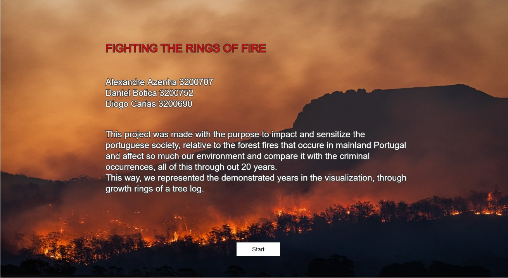
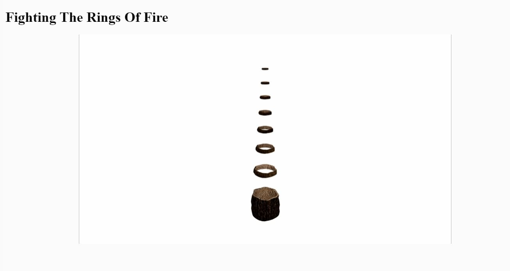
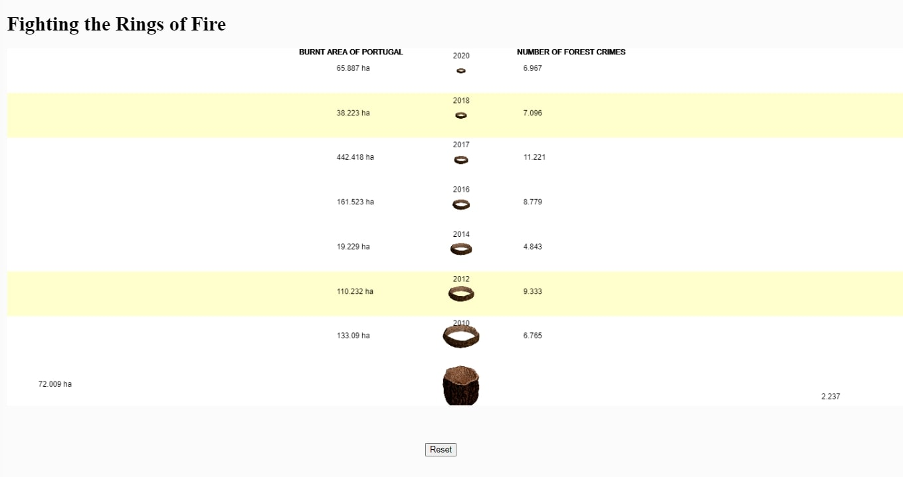
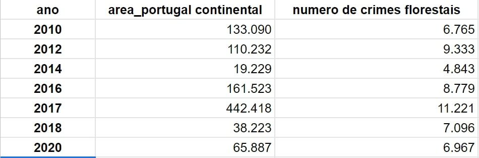

# FIGHTING THE RINGS OF FIRE

**CONTEXTUALIZAÇÃO DO PROJETO

Este projeto tem como objetivo analisar a relação entre área queimada do território de Portugal Continental e o número de crimes florestais ocorridos ao longo de 20 anos (entre 2010 e 2020). Para representar essa relação, utilizámos a metáfora dos anéis de crescimento de uma árvore, onde cada anel representa um ano. 

A floresta é um recurso indispensável para o meio ambiente e para sociedade, mas infelizmente, todos os anos é impactada por crimes ambientais.

Através deste projeto, queremos sensibilizar as pessoas da forma como as ações criminosas podem ter consequências graves para o meio ambiente e para a sociedade. O objetivo é que através desta visualização em p5*.js, as pessoas possam ver de forma clara como a área queimada está relacionada aos crimes ambientais e possa tomar consciência da importância de combater estes crimes.

Achámos pertinente a realização desta visualização, pois fornece uma nova maneira de entender e apresentar esta informação.

**O PROJETO

Esta visualização tem como objetivo demonstrar a relação entre a área queimada de portugal continental e o número de crimes florestais ocorridos ao longo de 20 anos, utilizando para representar os anos, uma metáfora com os aneis de crescimento das arvores. 

A visualização é dividida por três partes, começando pela welcome page, depois uma animação e por último a visualização interativa. 

**Welcome page 

Esta é a página inicial, onde se apresenta o nome do projeto e dos criadores e um breve texto introdutório que tem como objetivo dar uma contextualização ao utilizador. 

**Animação 

Esta animação aparece logo em seguida da welcome page e funciona como complemento para entender a metáfora, criada entre os anéis de crescimento da árvore e os anos presentes na visualização. Serve também como meio transitório entre a welcome page e a visualização interativa.

**Visualização interativa 

Esta página apresenta os conteúdos da tabela de forma centrada ao canvas, em que no lado esquerdo apresenta os dados referentes à área queimada de portugal continental e do lado direito os dados referentes ao número de crimes florestais. Ao centro, estão os diferentes anos acompanhados pelas respetivas imagens dos anéis de crescimento da árvore. 

Os dados da tabela são interativos, podendo selecionar dois anos diferentes para conseguir comparar a diferença de crimes e de área queimada nos anos selecionados. A diferença é apresentada na parte inferior do canvas. 
Na parte inferior e ao centro, colocou-se um botão de reset que permite descelecionar os anos que foram comparados, dando para que se possa fazer novas comparações. 

**TABELA E DADOS RECOLHIDOS

Fizemos uma pesquisa de forma a elaborar a tabela com os dados que precisavamos:

Ficheiro da tabela em csv e link para excel com dados da tabela: 
[tabela_dados.csv](./tabela_dados.csv)

https://docs.google.com/spreadsheets/d/1XnwZw1S8d8FlR3CjvhRGvkvDBMNkvxo-c3VKxccbbhQ/edit#gid=0

Os dados da tabela foram recolhidos a partir do site do ICNF(Instituto da Conservação da Natureza e das Florestas)

[Link do site ICNF] (http://www2.icnf.pt/portal/florestas/dfci/relat/rel-if)

**TECNOLOGIAS USADAS PARA DESENVOLVIMENTO DO PROJETO 

Para o desenvolvimento deste projeto foram utilizadas as seguintes ferramentas, p5.js, Blender, Adobe Photoshop, Adobe After Effects. 

**REFERÊNCIAS QUE AJUDARAM NA REALIZAÇÃO DO PROJETO

[Tutorial imagem background](https://www.youtube.com/watch?v=GssGJTwKOG0)

[Criar botão e dar reset](https://www.youtube.com/watch?v=lAtoaRz78I4)

[Criar elementos html](https://www.youtube.com/watch?v=Yk18ZKvXBj4)

[Múltiplos ficheiros js](https://www.youtube.com/watch?v=Yk18ZKvXBj4) 

Trabalho realizado por: 

Alexandre Azenha 3200707
Daniel Botica 3200752
Diogo Carias 3200690
